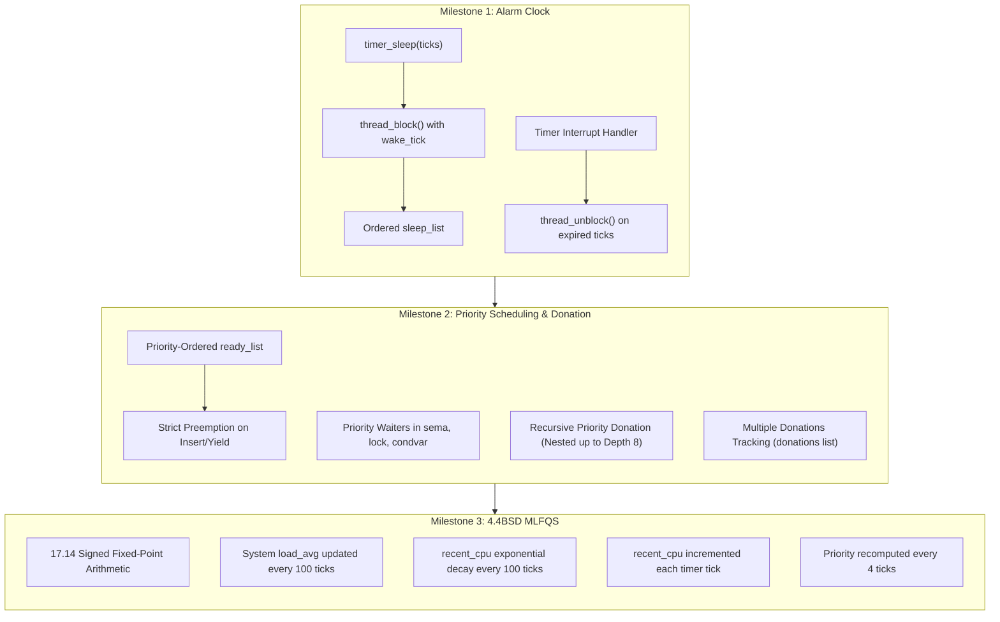
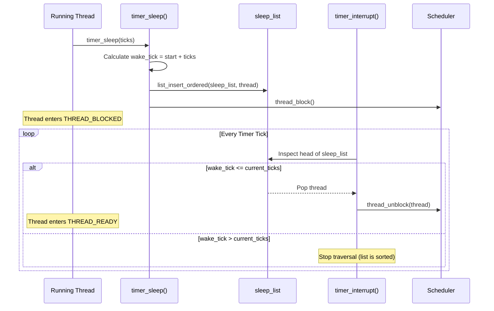
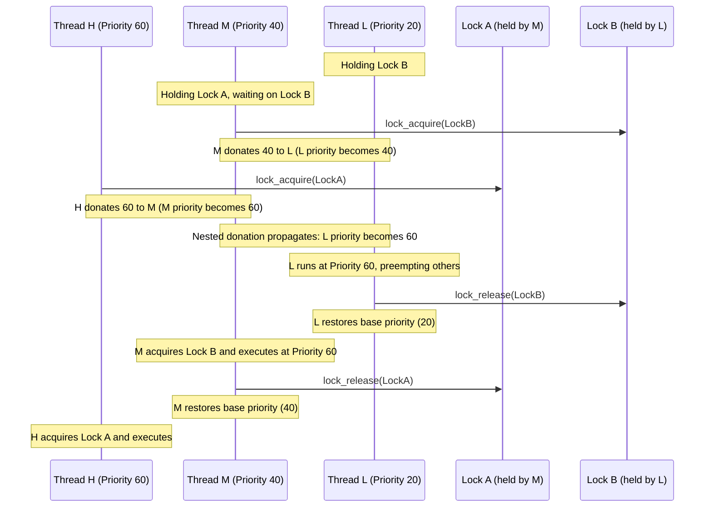
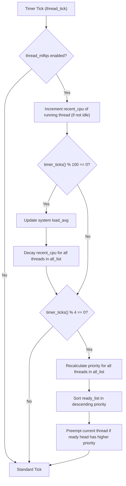

# Pintos Project 1: Threads

Operating Systems (CS2043) Laboratory Assignment 01  
Department of Computer Science and Engineering  
University of Moratuwa

---

## Abstract

This repository contains the complete implementation and test suite verification for Pintos Project 1 (Threads). The objective of this project is to eliminate inefficient busy-waiting in the timer subsystem, implement priority-based thread scheduling with support for recursive priority donation to prevent priority inversion, and construct a 4.4BSD Multi-Level Feedback Queue Scheduler (MLFQS) featuring dynamic load tracking, CPU decay, and priority recomputation using 17.14 fixed-point arithmetic.

All 27 test cases across Alarm Clock, Priority Scheduling, and MLFQS pass with a 100% success rate under QEMU.

---

## Architectural Overview

The core kernel enhancements are divided into three distinct functional milestones:



---

## Milestone 1: Re-implementing the Alarm Clock

### 1. Problem Definition
The default Pintos implementation of `timer_sleep()` operates via a busy-waiting loop (`while (timer_elapsed(start) < ticks) thread_yield();`). This consumes CPU cycles needlessly and saturates the ready queue, degrading overall system throughput.

### 2. Implementation Details
- **Sleep Queue (`sleep_list`)**: A dedicated kernel list initialized in `devices/timer.c` to track sleeping threads in strictly ascending order of their `wake_tick`.
- **Thread Blocking**: In `timer_sleep()`, if the sleep duration is positive, the thread records its target wake time in `thread->wake_tick`, disables interrupts, inserts itself into `sleep_list` using `list_insert_ordered()`, and transitions to `THREAD_BLOCKED` via `thread_block()`.
- **Interrupt Handler Wake-up**: At each timer tick in `timer_interrupt()`, the head of `sleep_list` is inspected. Any thread whose `wake_tick <= ticks` is removed from `sleep_list` and unblocked via `thread_unblock()`. Because the list is kept sorted, examination halts at the first thread whose wake time has not yet arrived ($O(1)$ amortized inspection).



---

## Milestone 2: Priority Scheduling & Priority Donation

### 1. Priority Scheduling & Preemption
- Pintos thread priorities range from `PRI_MIN` (0) to `PRI_MAX` (63), with `PRI_DEFAULT` (31).
- The `ready_list` is maintained in descending priority order.
- Whenever a thread is unblocked or created with a priority higher than the currently executing thread, the current thread immediately yields the CPU (`thread_preempt_if_needed()`).
- In `sema_down()`, `sema_up()`, and `cond_signal()`, waiting threads are queued by priority. When a resource is released, the highest-priority waiter is awakened first.

### 2. Priority Inversion and Donation
When a high-priority thread ($H$) attempts to acquire a lock held by a low-priority thread ($L$), priority inversion can occur if a medium-priority thread ($M$) preempts $L$. To solve this, priority donation is implemented:

- **Single Donation**: $H$ donates its effective priority to $L$.
- **Multiple Donations**: If multiple threads ($H_1, H_2$) wait on different locks held by $L$, $L$ maintains a `donations` list. Its effective priority is $\max(\text{base\_priority}, \max(\text{donations}))$.
- **Nested Donation**: If $H$ waits on a lock held by $M$, and $M$ waits on a lock held by $L$, the priority of $H$ is propagated recursively through the chain of lock holders up to a maximum search depth (depth limit 8).
- **Lock Release**: When a thread releases a lock, all donations associated with that specific lock are purged from the thread's `donations` list, and its priority is recalculated.



---

## Milestone 3: 4.4BSD Multi-Level Feedback Queue Scheduler (MLFQS)

### 1. Design Principles
When the kernel is booted with `-mlfqs`, static priority and priority donation are disabled. Priorities are dynamically recalculated based on recent CPU usage and system load average:
- Threads that consume excessive CPU have their priority reduced.
- Threads that yield or block frequently (e.g., I/O bound) retain higher priorities.

### 2. 17.14 Fixed-Point Arithmetic Library
Because the x86 Pintos kernel runs without floating-point support, all calculations use signed 17.14 fixed-point arithmetic ($1 \text{ integer} = 2^{14} = 16384$).

| Operation | Mathematical Form | Fixed-Point C Macro |
|---|---|---|
| Convert Integer $n$ to FP | $n \times f$ | `fp_from_int(n)` |
| Convert FP $x$ to Int (round zero) | $x / f$ | `fp_to_int_zero(x)` |
| Convert FP $x$ to Int (round nearest) | $(x \ge 0 \ ? \ x + f/2 : x - f/2) / f$ | `fp_to_int_round(x)` |
| Add FP $x$ and FP $y$ | $x + y$ | `fp_add(x, y)` |
| Subtract FP $y$ from FP $x$ | $x - y$ | `fp_sub(x, y)` |
| Add FP $x$ and Int $n$ | $x + n \times f$ | `fp_add_int(x, n)` |
| Multiply FP $x$ by FP $y$ | $((\text{int64\_t}) x \times y) / f$ | `fp_mul(x, y)` |
| Multiply FP $x$ by Int $n$ | $x \times n$ | `fp_mul_int(x, n)` |
| Divide FP $x$ by FP $y$ | $((\text{int64\_t}) x \times f) / y$ | `fp_div(x, y)` |
| Divide FP $x$ by Int $n$ | $x / n$ | `fp_div_int(x, n)` |

### 3. Core Equations & Timing

#### Per Timer Tick (Every 1 Tick)
If the current running thread is not the idle thread, its `recent_cpu` counter is incremented by 1:
$$\text{recent\_cpu} \leftarrow \text{recent\_cpu} + 1$$

#### System Load Average (Every 100 Ticks / 1 Second)
The load average represents the average number of threads ready to run or running over the past minute:
$$\text{load\_avg} \leftarrow \left(\frac{59}{60}\right) \times \text{load\_avg} + \left(\frac{1}{60}\right) \times \text{ready\_threads}$$

#### Recent CPU Decay (Every 100 Ticks / 1 Second)
For every thread (running, ready, or blocked):
$$\text{recent\_cpu} \leftarrow \left(\frac{2 \times \text{load\_avg}}{2 \times \text{load\_avg} + 1}\right) \times \text{recent\_cpu} + \text{nice}$$

#### Priority Recalculation (Every 4 Ticks)
For every thread, priority is recalculated using the updated `recent_cpu` and `nice` values, clamped between `PRI_MIN` (0) and `PRI_MAX` (63):
$$\text{priority} \leftarrow \text{PRI\_MAX} - \left(\frac{\text{recent\_cpu}}{4}\right) - (\text{nice} \times 2)$$



---

## Test Suite Verification

All 27 test cases pass unconditionally.

### Summary Table

| Milestone | Test Target | Description | Status |
|---|---|---|---|
| **Alarm Clock** | `alarm-single` | Verifies single thread sleep and accurate wake-up | **PASS** |
| | `alarm-multiple` | Verifies multiple threads sleeping for distinct durations | **PASS** |
| | `alarm-simultaneous` | Verifies multiple threads sleeping for identical durations | **PASS** |
| | `alarm-zero` | Verifies zero-tick sleep returns immediately | **PASS** |
| | `alarm-negative` | Verifies negative tick values return without sleeping | **PASS** |
| **Priority Scheduling** | `alarm-priority` | Verifies priority wake-up order from alarm sleep | **PASS** |
| | `priority-change` | Verifies dynamic thread priority lowering triggers preemption | **PASS** |
| | `priority-fifo` | Verifies FIFO ordering among threads with identical priority | **PASS** |
| | `priority-preempt` | Verifies high-priority thread preempts low-priority thread | **PASS** |
| | `priority-sema` | Verifies semaphore waiter selection follows priority | **PASS** |
| | `priority-condvar` | Verifies condition variable waiter signaling by priority | **PASS** |
| **Priority Donation** | `priority-donate-one` | Verifies single priority donation from high to low thread | **PASS** |
| | `priority-donate-multiple` | Verifies priority restoration after releasing one of multiple donations | **PASS** |
| | `priority-donate-multiple2` | Verifies multiple lock acquisitions with distinct priority donors | **PASS** |
| | `priority-donate-nest` | Verifies recursive donation propagation across lock chains | **PASS** |
| | `priority-donate-sema` | Verifies donation interaction when waiting on semaphores | **PASS** |
| | `priority-donate-lower` | Verifies base priority reduction while holding active donation | **PASS** |
| | `priority-donate-chain` | Verifies deep chain priority donation propagation (7 locks) | **PASS** |
| **MLFQS** | `mlfqs-load-1` | Verifies system load average growth with a single active load thread | **PASS** |
| | `mlfqs-load-60` | Verifies load average stability and decay across 60 load threads | **PASS** |
| | `mlfqs-load-avg` | Verifies theoretical exponential curve of load average tracking | **PASS** |
| | `mlfqs-recent-1` | Verifies single-thread recent_cpu exponential decay curve | **PASS** |
| | `mlfqs-fair-2` | Verifies fair CPU share allocation between 2 threads | **PASS** |
| | `mlfqs-fair-20` | Verifies fair CPU distribution across 20 compute-bound threads | **PASS** |
| | `mlfqs-nice-2` | Verifies proportional CPU distribution under distinct nice values (2 threads) | **PASS** |
| | `mlfqs-nice-10` | Verifies proportional CPU share under distinct nice values (10 threads) | **PASS** |
| | `mlfqs-block` | Verifies blocked threads receive proper recent_cpu decay without starvation | **PASS** |

**Overall Score: 27 / 27 Tests Passed (100%)**

---

## File and Component Modifications

```
src/
├── devices/
│   ├── timer.c                Sleep queue management, list_insert_ordered, wake-up logic
│   └── timer.h                Function declarations for sleep list subsystem
└── threads/
    ├── fixed-point.h          [NEW] 17.14 signed fixed-point macro arithmetic library
    ├── synch.c                Priority donation logic in lock_acquire and lock_release
    ├── synch.h                Priority comparison function declarations for sema and condvar
    ├── thread.c               Ready queue sorting, preemption, MLFQS load/decay/priority calculations
    └── thread.h               Thread structure enhancements (wake_tick, base_priority, donations, nice, recent_cpu)
```

---

## Build and Execution Guide

### Prerequisites
- Ubuntu 22.04 LTS / 24.04 LTS or WSL2
- GCC cross-compiler (`gcc-multilib`, `binutils`)
- QEMU simulator (`qemu-system-x86`)
- Perl (for test assertion verification)

### Compilation
From the `src/threads` directory:

```bash
cd src/threads
make
```

### Running Test Suites
To run all tests:

```bash
cd src/threads/build
make check
```

To run individual milestone tests:

```bash
# Alarm clock
make tests/threads/alarm-single.result

# Priority donation
make tests/threads/priority-donate-one.result

# MLFQS scheduler
make tests/threads/mlfqs-load-avg.result
```

---

## Author

- **Shashika Dayarathna** (`shashika-mora`)  
  Department of Computer Science and Engineering  
  University of Moratuwa
