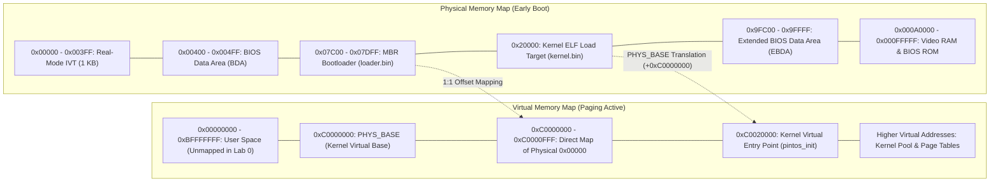
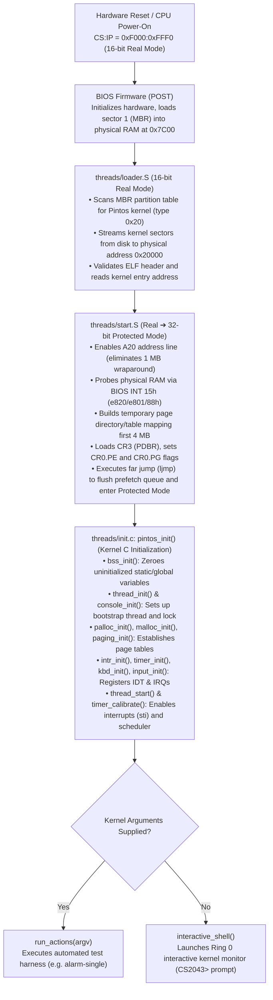
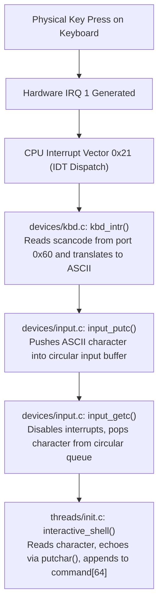

# Lab 0 — Getting Real: Boot, GDB & Kernel Monitor

CS2043 – Operating Systems  
Department of Computer Science and Engineering, University of Moratuwa

---

## 1. Overview & Objectives

Laboratory 0 marks the transition from abstract operating system concepts to concrete, bare-metal systems programming on the x86 architecture. In Pintos, the kernel executes with full hardware privileges (Ring 0), assuming direct responsibility for physical memory, processor execution modes, interrupts, and device I/O.

### Primary Objectives
1. **Boot Path Tracing**: Understand and verify the deterministic execution sequence from motherboard firmware (BIOS POST) through the real-mode bootloader (`threads/loader.S`), protected-mode kernel startup (`threads/start.S`), and kernel C initialization (`threads/init.c:pintos_init()`).
2. **Kernel Debugging with GDB**: Master remote target debugging using GDB attached to QEMU's internal debugging stub over TCP port 1234.
3. **Interactive Kernel Monitor**: Implement an interactive, bare-metal command monitor running inside the kernel before userland processes or filesystem infrastructure exist.

---

## 2. The x86 Physical & Virtual Memory Architecture

Pintos maps physical memory to virtual memory using an offset known as `PHYS_BASE` (`0xc0000000` or 3 GB). The kernel resides in higher-half virtual memory, while the lowest physical addresses are reserved for historical PC architecture components.



- **`0x7C00`**: The architectural address where BIOS loads the 512-byte Master Boot Record (MBR).
- **`0x20000`**: The temporary physical memory location where `loader.S` loads the kernel payload sectors from disk.
- **`0xC0000000` (`PHYS_BASE`)**: The virtual memory base address for the kernel. All physical memory `paddr` is accessible in the kernel via `ptov(paddr) = paddr + PHYS_BASE`.

---

## 3. The Complete Pintos Boot Sequence

The Pintos boot pipeline spans four distinct execution phases:



### Phase 1: BIOS Firmware (POST)
When the computer or emulator boots, the CPU begins execution at the reset vector `0xFFFF0` (`CS:IP = 0xF000:0xFFF0`) in 16-bit real mode. The BIOS conducts power-on self-tests, initializes peripheral controllers, scans available boot devices, loads the first 512-byte sector of the boot drive into physical memory at `0x07C00`, verifies the boot signature `0x55AA`, and jumps to `0x7C00`.

### Phase 2: The MBR Loader (`threads/loader.S`)
Operating in 16-bit real mode, the loader:
1. Normalizes CPU segment registers (`%cs`, `%ds`, `%es`, `%ss`) to zero.
2. Scans the Master Boot Record partition table (starting at offset 446) looking for a partition flagged with type `0x20` (Pintos kernel partition).
3. Issues BIOS `INT 13h` extensions to stream the kernel binary from disk into RAM at physical address `0x20000`.
4. Reads the 32-bit ELF executable header at `0x20000`, validates the ELF magic bytes (`\x7fELF`), locates the entry point address field (which resolves to `0xc0020000`), and transfers control to `threads/start.S`.

### Phase 3: Transition to Protected Mode (`threads/start.S`)
Before executing 32-bit C code, `start.S` prepares the CPU execution state:
1. **A20 Line Activation**: Overcomes the historical 1 MB 8086 memory wraparound bug by enabling the A20 address line via the 8042 keyboard controller ports (`0x64`, `0x60`) and the fast A20 port (`0x92`).
2. **RAM Probing**: Queries the BIOS via `INT 15h` (`e820`, `e801`, and `88h`) to determine total physical memory size and stores page counts in `init_ram_pages`.
3. **Temporary Page Tables**: Constructs a preliminary page directory and page table to map the first 4 MB of physical memory to both:
   - Physical address `0x00000000` (identity mapping to avoid crashing when the instruction pointer switches to paging).
   - Virtual address `0xc0000000` (`PHYS_BASE`, where the kernel is linked).
4. **Enabling Paging and Protected Mode**:
   - Loads the page directory address into `CR3` (Page Directory Base Register).
   - Loads the Global Descriptor Table Register (`GDTR`) with descriptor entries for 32-bit code and data segments.
   - Sets the Protection Enable (`PE`, bit 0) and Paging (`PG`, bit 31) flags in Control Register 0 (`CR0`).
5. **Instruction Pipeline Flush**: Executes a far jump (`ljmp $SEL_KCSEG, $1f`) to clear the 16-bit prefetch queue, updates segment registers (`%ds`, `%es`, `%ss`) to the kernel data selector (`SEL_KDSEG = 0x10`), configures the kernel stack pointer, and calls `pintos_init`.

### Phase 4: Kernel C Initialization (`threads/init.c`)
`pintos_init()` organizes kernel initialization into a strict dependency chain:
1. `bss_init()`: Clears the BSS segment (uninitialized static and global variables) between `_start_bss` and `_end_bss` as defined in the linker script (`kernel.lds.S`).
2. `read_command_line()` & `parse_options()`: Extracts arguments written into the bootloader image by the host launcher.
3. `thread_init()`: Initializes the thread scheduling subsystem, setting up the main initial executing thread in memory.
4. `console_init()`: Configures the console spinlock so kernel output can be synchronized across threads.
5. `palloc_init()`, `malloc_init()`, `paging_init()`: Divides physical memory into a kernel memory pool and a user memory pool; establishes permanent two-level page directories.
6. `intr_init()`, `timer_init()`, `kbd_init()`, `input_init()`: Registers the CPU Interrupt Descriptor Table (IDT), configures the 8254 Programmable Interval Timer (PIT) to 100 Hz, binds IRQ 1 to the keyboard interrupt handler (`kbd_intr`), and initializes the circular input buffer queue.
7. `thread_start()`, `timer_calibrate()`: Enables CPU hardware interrupts via `sti`, starts the thread scheduler, and calibrates the timer loop counter.

---

## 4. Interactive Kernel Monitor

When Pintos finishes booting without command-line arguments, it enters `interactive_shell()`.

### Kernel-Mode Monitor vs. Userspace Shell

| Property | Kernel Monitor (`interactive_shell`) | Userspace Shell (`bash`, `sh`, Pintos Lab 2) |
| :--- | :--- | :--- |
| **Execution Privilege** | Ring 0 (Kernel Mode) | Ring 3 (User Mode) |
| **Standard Library** | None. Operates directly on Pintos kernel primitives. | Linked against standard C library (`libc`). |
| **I/O Mechanism** | Direct device queues (`devices/input.c`, `console.c`). | System calls (`read`, `write`, `ioctl`). |
| **Process Model** | Runs inside the kernel boot thread. | Executes as a standalone user process using `fork()` / `exec()`. |

### Input Architecture & Concurrency Synchronization



1. **Character Reception**: When a key is pressed, the keyboard controller raises IRQ 1, triggering `kbd_intr()`. The scancode is translated into an ASCII character and pushed into a circular queue via `input_putc()`.
2. **Blocking Input**: `input_getc()` retrieves characters from the queue. If the queue is empty, the calling thread blocks until the interrupt handler writes a new character.
3. **Synchronization & Atomicity**: `input_getc()` disables interrupts (`intr_disable()`) while accessing the circular buffer pointers. This prevents a race condition where a keyboard interrupt could fire and modify the queue head/tail simultaneously.
4. **Explicit Echoing**: The hardware keyboard driver does not automatically display characters on the screen. The monitor must explicitly echo each received character back to the console via `putchar(c)`.
5. **Bounded Stack Buffer**: Input is accumulated in a 64-byte bounded buffer (`char command[64]`). Buffer boundaries are strictly checked to prevent stack corruption.

### Implemented Monitor Commands

The interactive monitor supports the following commands:

| Command | Handler & Mechanism | Output / Action |
| :--- | :--- | :--- |
| `whoami` | Custom handler in `init.c` | Displays author identity and registration number: `Shashika Dayarathna - 240092V`. |
| `shutdown` | `devices/shutdown.c: shutdown_power_off()` | Issues ACPI and APM hardware power-off commands to terminate the QEMU emulator cleanly. |
| `time` | `devices/rtc.c: rtc_get_time()` | Reads CMOS Real-Time Clock registers and prints elapsed seconds since Unix epoch (`1970-01-01`). |
| `ram` | `init_ram_pages * PGSIZE / 1024` | Calculates and prints total available system memory in kilobytes (e.g., `3968 kB`). |
| `thread` | `threads/thread.c: thread_print_stats()` | Dumps thread scheduler metrics, including total timer ticks, kernel ticks, and context switch counts. |
| `priority` | `threads/thread.c: thread_get_priority()` | Queries and displays the scheduling priority of the current running thread (`31` by default). |
| `exit` | Loop break statement | Breaks out of the command loop, returning to `pintos_init()` to allow clean thread exit and shutdown. |

---

## 5. Kernel Debugging with GDB

Because the kernel runs on bare-metal emulated hardware, debugging is performed by connecting GDB to QEMU's internal debugging server.

### Launching the Debugging Environment

Open two separate WSL2 terminal instances:

#### Terminal 1: Start QEMU with GDB Server
```bash
cd ~/cs2043/pintos/src/threads/build
pintos --qemu --gdb -- -q
```
QEMU halts immediately before executing the first BIOS instruction, listening on TCP port `1234`.

#### Terminal 2: Connect GDB
```bash
cd ~/cs2043/pintos/src/threads/build
pintos-gdb kernel.o
```

At the GDB prompt:
```gdb
(gdb) target remote localhost:1234
```

### Key Verification Breakpoints

```gdb
# 1. Break at BIOS MBR handoff (physical address 0x7C00)
(gdb) break *0x7c00
(gdb) continue

# 2. Break at protected mode entry in start.S
(gdb) break start
(gdb) continue

# 3. Break at C entry point in init.c
(gdb) break pintos_init
(gdb) continue

# 4. Break at interactive shell command loop
(gdb) break interactive_shell
(gdb) continue
```

### Essential GDB Inspection Commands

```gdb
# Inspect next 10 instructions at current Instruction Pointer
(gdb) x/10i $eip

# Display all CPU registers (EAX, EBX, ECX, EDX, ESP, EBP, EIP, EFLAGS, CR0, CR3)
(gdb) info registers

# Print backtrace of active stack frames
(gdb) backtrace

# Inspect memory at specific address
(gdb) x/16xw 0x20000
```

---

## 6. Theory Alignment with CS2043

| Curriculum Topic | Lecture Alignment | Concrete Pintos Implementation in Lab 0 |
| :--- | :--- | :--- |
| **System Boot & Hardware Reset** | Week 01: Computer System Organization | BIOS MBR handoff (`0x7C00`), `loader.S`, partition discovery. |
| **Processor Privilege Levels** | Week 01: Dual-Mode Operation | Ring 0 kernel execution, segment descriptors, GDT initialization. |
| **Paging & Virtual Addressing** | Week 06: Memory Management | `PHYS_BASE` mapping, temporary page tables in `start.S`, CR3 register. |
| **Interrupt Handlers & I/O** | Week 03: Interrupts & Hardware Protection | Programmable Interrupt Controller (PIC), IDT setup, keyboard IRQ 1 handler. |
| **Thread State & TCB** | Week 02: Processes & Threads | Bootstrap thread creation, stack frame initialization in `thread_init()`. |

---

## 7. Build and Execution Verification

### 1. Compile the Kernel
```bash
cd ~/cs2043/pintos/src/threads
make clean && make
```

### 2. Launch the Interactive Shell
```bash
cd build
pintos -v --qemu --
```

### 3. Example Session
```text
Pintos booting with 3,968 kB RAM...
367 pages available in kernel pool.
367 pages available in user pool.
Calibrating timer...  ... loops/s.
Boot complete.
CS2043> whoami
Shashika Dayarathna - 240092V
CS2043> ram
3,968 kB
CS2043> time
1725796800
CS2043> priority
31
CS2043> thread
Thread: 0 idle ticks, 12 kernel ticks, 0 user ticks
CS2043> exit
Exiting interactive shell...Bye!
Execution of '' complete.
Powering off...
```

---

Department of Computer Science and Engineering, University of Moratuwa.
